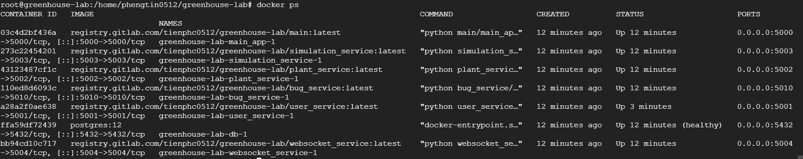
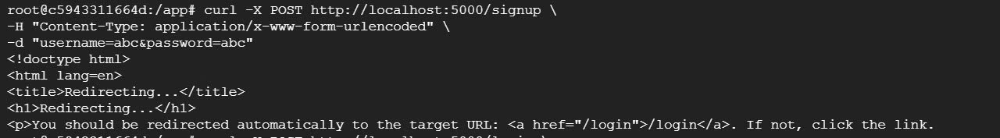
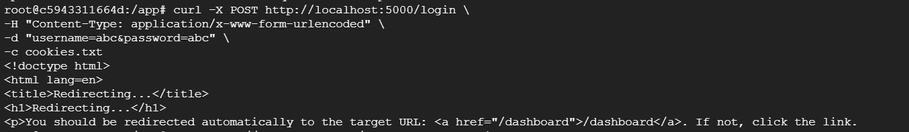
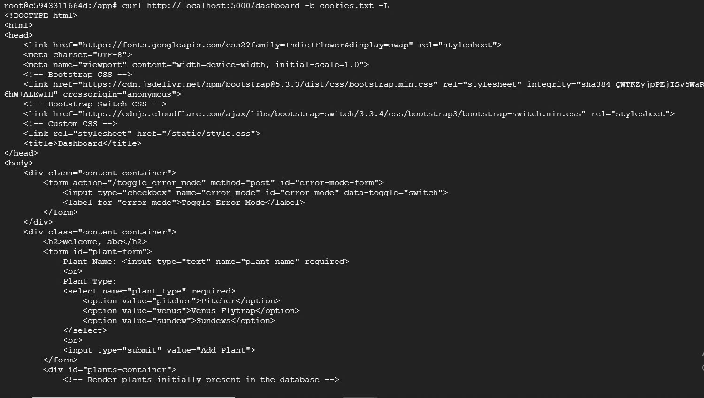
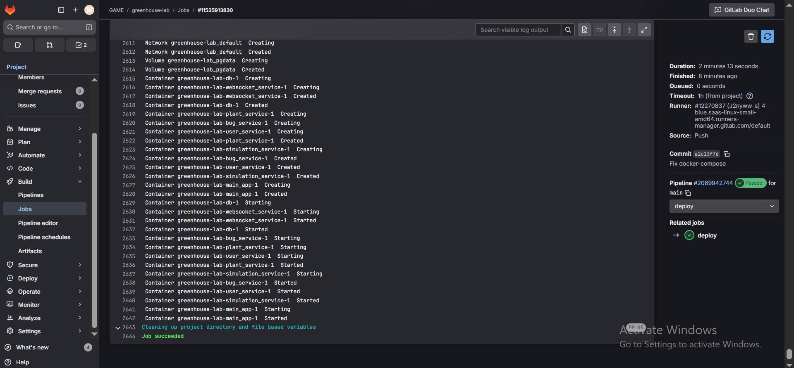
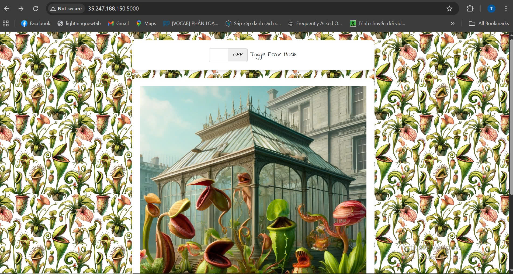
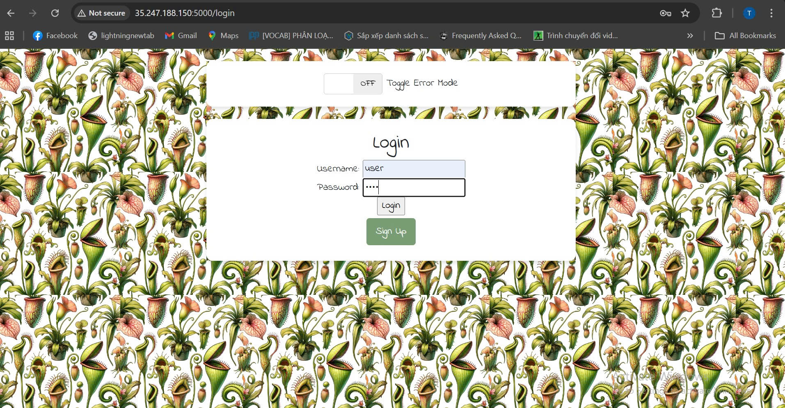
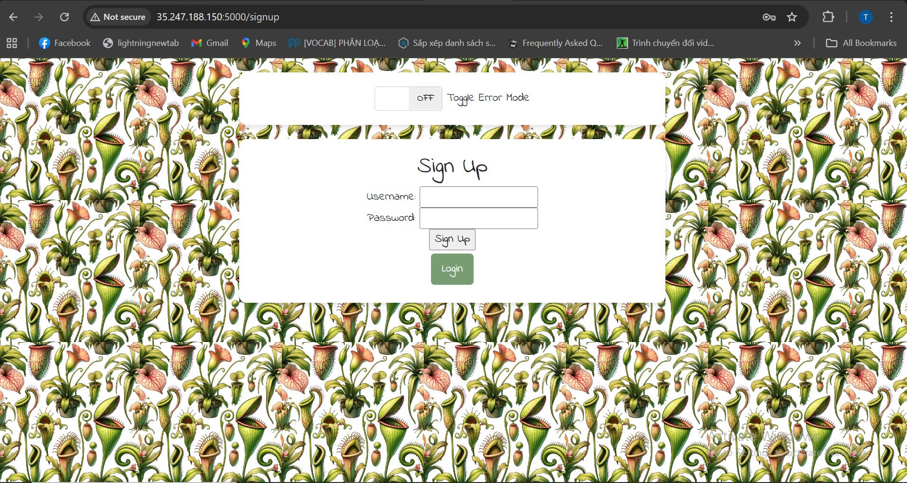
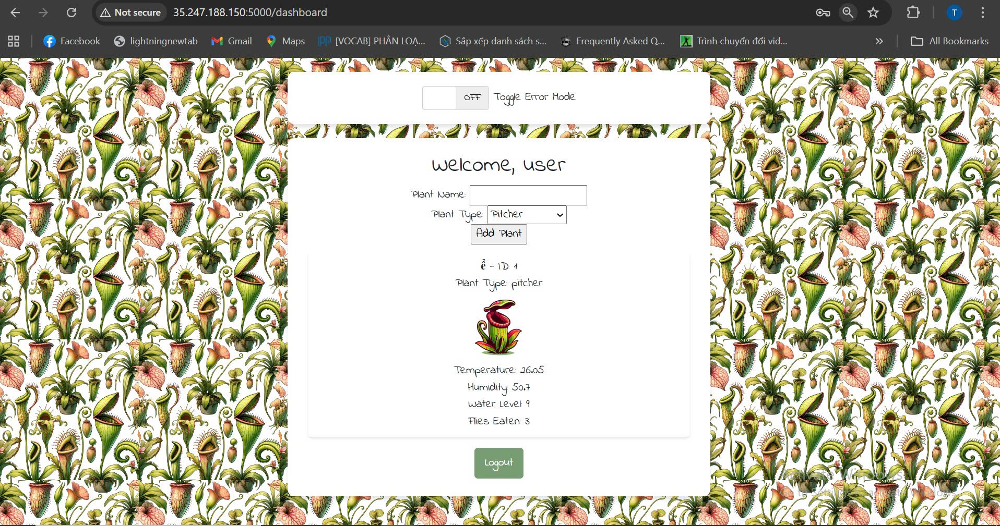

# Deploy Carnivorous Green House

## Features
 - user_service (python-port 5001)
 - plant_service (python-port 5002)
 - simulation_service (python-port 5003)
 - websocket_service (python-port 5004)
 - bug_service (python-port 5010)
 - main (python-port 5000)
 
 
## Requires
 - Containerzed for all services
 - Deploying "Green House" to server use docker compose

 - Create CI/CD for each service 

## Kết quả triển khai

### Containers đang chạy

### Response từ main_app/signup, /login, /dashboard

### Pipeline CI/CD

### Hình ảnh web 

